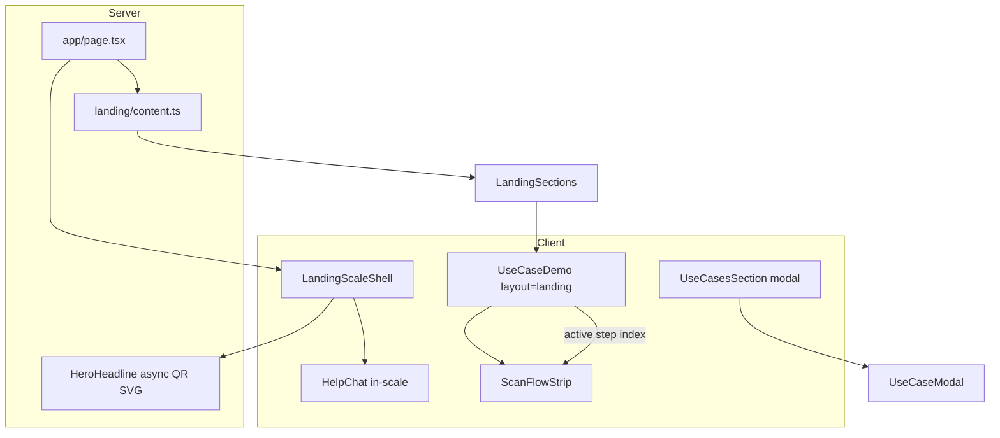

# Implementation Blueprint — Next-Gen RQ Plus Landing

**Date:** 2026-06-10  
**Parent spec:** [`2026-06-10-landing-future-design.md`](./2026-06-10-landing-future-design.md)  
**Scope:** Landing (§1–7) + auth/onboarding polish (§5 of parent spec)  
**Status:** Architecture blueprint — no production code

---

## Patterns & Conventions Found

| Pattern | Location | Reuse for landing |
|---------|----------|-------------------|
| **Proportional scale shell** | `components/DashboardScaleShell.tsx` — `computeDashboardScale()`, `REF_WIDTH=1440`, `MIN_SCALE=0.5`, ResizeObserver + visualViewport | Create `LandingScaleShell` with same math, **`transform-origin: top center`** (spec) vs dashboard `top left` |
| **Scale CSS hooks** | `globals.css` `.ip-dash-scale-viewport` / `-slot` / `-root` (lines ~1342–1468) | Mirror as `.ip-landing-scale-*` or share generic `.ip-scale-*` base |
| **Marketing chrome** | `MarketingPage.tsx` — `GlowBackground` + `MarketingNav` + `ip-main-content` + footer + `HelpChat` | Landing keeps custom structure; do **not** wrap in `MarketingPage` (no scroll-snap there) |
| **Section intro** | `PageIntro.tsx` — centered title + `BalancedText` | Use pattern for section kickers; landing already uses raw `h2.ip-section-title` |
| **Glass panels** | `.ip-panel` (gallery/pricing), `.ip-card-glow`, `.ip-auth-card-confirm` | Extend with Luminous Portal tokens (`--portal-glass`, `--portal-rim`) |
| **Pricing grid** | `.ip-pricing-grid-compact` on `/pricing` | Landing §6 stays text-only; no grid import |
| **Full-viewport sections** | `.ip-landing`, `.ip-landing-section`, scroll-snap (globals ~4265+) | Already present; tune gaps/sizes per spec |
| **Landing data inline** | `page.tsx` `whyItems`, `howSteps` arrays | Extract to `landing/content.ts` when splitting sections |
| **Demo pipeline** | `ScanDemo` → `UseCaseDemo` with `priorityFrames`, auto-advance interval | Add `layout="landing"` mode; sole JS animation loop |
| **Hero QR** | `HeroHeadline.tsx` server `qrcode` SVG | Keep server-only; add scan-sweep CSS |
| **Motion** | `ip-fade-up`, `ip-reticle-pulse`, `ip-mesh-drift`, `prefers-reduced-motion` block (~4732) | CSS-only; **no** `framer-motion` in `package.json` |
| **Copy rules** | `BalancedText`, `&` not “and”, ALL CAPS section titles | Align hero lead to 3 spec lines; fix CTAs |

### Gap vs spec (current `page.tsx`)

- Hero lead is **2 lines**; spec requires **3** (§7 parent spec).
- Primary CTA: **GET STARTED** → **GET STARTED FREE**; secondary missing **↓**.
- Badge: sentence case → **VISUAL SCAN · PROGRAMMABLE LINKS** (mono pill).
- `UseCasesSection compact` renders **all 6** cases; spec needs **3** (`limit={3}`).
- `UseCaseDemo` still shows **“How it works”** verbose block; spec hides on landing.
- **SCAN → MATCH → OPEN** flow strip: CSS exists (`.ip-scan-demo-flow`, ~231) but **no TSX wires it**.
- **No scale shell** on landing yet; dashboard has `DashboardScaleShell`.
- `HelpChat` uses `position: fixed` (~1856); spec requires FAB inside scale root.

---

## Architecture Decision

**Ship Luminous Portal by evolving the existing landing stack** — not a rewrite, not `MarketingPage`, not a new CSS framework.

1. **`LandingScaleShell`** wraps nav + main + footer + help FAB (mirror `DashboardScaleShell` API).
2. **Thin `page.tsx`** composes seven section components; static copy in `landing/content.ts`.
3. **`UseCaseDemo` landing mode** — one prop surface (`layout="landing"`) controls compact chrome, flow strip, hidden verbose guide.
4. **CSS:** extend `:root` portal tokens + augment existing `.ip-landing-*` block in `globals.css` (~150 new lines). **No** separate CSS module file (matches repo: single `globals.css`).
5. **Motion:** CSS-only; no new dependencies.
6. **Auth/onboarding:** token + layout polish only in same PR or follow-up PR phase 2 (recommended: phase 2 to keep landing PR reviewable).

**Trade-off:** Shared scale logic duplicated vs extracted. **Decision:** extract `lib/scale-shell.ts` with `REF_WIDTH`, `MIN_SCALE`, `computeScale()` used by both shells — avoids drift, ~30 lines.

**Trade-off:** `transform-origin: top center` vs dashboard `top left`. **Decision:** landing shell centers slot (`justify-content: center` on viewport); inner root 1440px wide — matches spec visual centering without changing dashboard.

---

## Component Decomposition

```
apps/web/
├── app/page.tsx                          # Orchestrator only (~40 lines)
├── components/
│   ├── LandingScaleShell.tsx             # NEW — client scale wrapper
│   ├── landing/
│   │   ├── content.ts                    # NEW — howSteps, whyItems, hero copy constants
│   │   ├── LandingHeroSection.tsx        # NEW — badge, HeroHeadline, lead, CTAs
│   │   ├── LandingScanSection.tsx        # NEW — title + ScanDemo
│   │   ├── LandingHowSection.tsx         # NEW — 3-col steps
│   │   ├── LandingWhySection.tsx         # NEW — 3-col why cards
│   │   ├── LandingUseCasesSection.tsx    # NEW — thin wrapper: title + UseCasesSection limit=3
│   │   ├── LandingPricingSection.tsx     # NEW — compact pricing blurb
│   │   ├── LandingCtaSection.tsx         # NEW — final glass CTA card
│   │   ├── HeroHeadline.tsx              # MODIFY — scan sweep wrapper, QR size cap
│   │   ├── ScanDemo.tsx                  # MODIFY — pass layout="landing"
│   │   ├── UseCaseDemo.tsx               # MODIFY — landing layout branch
│   │   ├── ScanFlowStrip.tsx             # NEW — SCAN → MATCH → OPEN (active step sync)
│   │   └── UseCasesSection.tsx           # MODIFY — thumb height cap via compact prop
│   └── HelpChat.tsx                      # MODIFY — optional `position="in-scale"` class
└── lib/
    └── scale-shell.ts                    # NEW — shared scale math (extracted from dashboard)
```

### Component responsibilities

| Component | Responsibility | Server/Client |
|-----------|----------------|---------------|
| `LandingScaleShell` | ResizeObserver scale, set `--landing-scale`, slot height sync | Client |
| `LandingHeroSection` | Spec copy, CTAs, animation classes | Server (imports async `HeroHeadline`) |
| `LandingScanSection` | Section shell + `ScanDemo` | Server wrapper; demo client |
| `ScanFlowStrip` | Maps demo step index → SCAN / MATCH / OPEN highlight | Client |
| `UseCaseDemo` | `layout="landing"`: hide works block, smaller frame, flow strip slot | Client |
| `LandingHowSection` / `LandingWhySection` | Map `content.ts` → 3-col grids | Server |
| `LandingUseCasesSection` | `UseCasesSection compact limit={3}` | Server + client children |
| `HeroHeadline` | QR SVG + gradient line 3; sweep pseudo-element | Async Server |

**Do not split further** (footer, nav stay shared `MarketingNav` / `MarketingFooter`).

---

## File-by-File Change List

### Create

| File | Changes |
|------|---------|
| `lib/scale-shell.ts` | `REF_WIDTH=1440`, `MIN_SCALE=0.5`, `computeScale(w)`, `getViewportWidth()` — move from `DashboardScaleShell` |
| `components/LandingScaleShell.tsx` | Client shell: `.ip-landing-scale-viewport` > slot > root (1440px); `transform-origin: top center`; sets `--landing-scale` on `documentElement` |
| `components/landing/content.ts` | `HERO_LEAD_LINES`, `HERO_BADGE`, CTA labels/hrefs, `HOW_STEPS`, `WHY_ITEMS`, `PRICING_LINES`, `CTA_LINES` — typed `as const` |
| `components/landing/LandingHeroSection.tsx` | §1 markup from current `page.tsx` + spec copy |
| `components/landing/LandingScanSection.tsx` | `id="scan-demo"`, QUICK GUIDE title, `<ScanDemo />` |
| `components/landing/LandingHowSection.tsx` | `id="how-it-works"`, steps row |
| `components/landing/LandingWhySection.tsx` | WHY RQ PLUS row |
| `components/landing/LandingUseCasesSection.tsx` | USE CASES + `<UseCasesSection compact limit={3} />` |
| `components/landing/LandingPricingSection.tsx` | PRICING blurb + link |
| `components/landing/LandingCtaSection.tsx` | Final CTA card |
| `components/landing/ScanFlowStrip.tsx` | Props: `activePhase: 'scan' \| 'match' \| 'open'`; renders `.ip-scan-demo-flow` |

### Modify

| File | Changes |
|------|---------|
| `app/page.tsx` | Replace body with `<LandingScaleShell>` wrapping `GlowBackground`, `MarketingNav`, `<main>` of 7 sections, `MarketingFooter`, `<HelpChat position="in-scale" />` |
| `components/DashboardScaleShell.tsx` | Import scale helpers from `lib/scale-shell.ts` (behavior unchanged) |
| `components/landing/HeroHeadline.tsx` | Add `.ip-hero-qr-sweep` child for CSS animation; cap QR `max-width: 280px` in landing context via class `.ip-landing-hero .ip-hero-qr-bg` |
| `components/landing/ScanDemo.tsx` | `<UseCaseDemo layout="landing" … />` |
| `components/landing/UseCaseDemo.tsx` | Add `layout?: 'default' \| 'landing'`; landing: wrap in `.ip-scan-demo-wrap`, render `ScanFlowStrip`, hide `.ip-demo-works`, use 2-line `BalancedText` from step subtitle only, cap frame 240px |
| `components/landing/UseCasesSection.tsx` | When `compact`: `max-height: 22vh` on thumb via class; ensure `limit` prop passed from wrapper |
| `components/HelpChat.tsx` | Add `position?: 'fixed' \| 'in-scale'` — `in-scale` applies `.ip-help-chat-in-scale` (absolute bottom-right inside scale root) |
| `app/globals.css` | See CSS strategy below |
| `app/login/confirm-email/page.tsx` | ALL CAPS badge/title; tighten padding 15%; shorten step list to 3 balanced lines (phase 2) |
| `app/auth/welcome/page.tsx` | ALL CAPS; max-height ≤55vh; glass rim class (phase 2) |
| `components/OnboardingStrip.tsx` | ALL CAPS title; dismiss below title; active pill glow ring (phase 2) |

### Do not create

- New route files, API routes, or scan/auth changes
- `landing.module.css` or Tailwind (project uses plain CSS)
- Framer Motion / GSAP / Lottie assets

---

## CSS Strategy

**Extend `globals.css` in three layers** (no new module file — matches existing `ip-*` system).

### Layer 1 — Global tokens (`:root`, after line ~26)

```css
--portal-glass: color-mix(in srgb, var(--bg-card) 72%, transparent);
--portal-rim: color-mix(in srgb, var(--accent) 22%, var(--border));
--portal-scan-line: color-mix(in srgb, var(--accent) 35%, transparent);
--landing-scale: 1;   /* set by LandingScaleShell */
```

Apply Luminous rim to `.ip-landing-step-card`, `.ip-landing-compact-card`, `.ip-landing-cta-card`:

```css
border: 1px solid var(--portal-rim);
box-shadow: inset 0 1px 0 color-mix(in srgb, white 6%, transparent);
```

Dark: add `backdrop-filter: blur(12px)` on **one** layer per card (`.ip-card` landing variants only).

### Layer 2 — Scale shell (new block after dashboard scale, ~line 1470)

```css
.ip-landing-scale-viewport { /* flex center, min-height 100vh, overflow-x auto */ }
.ip-landing-scale-slot { /* width = 1440 * scale */ }
.ip-landing-scale-root { width: 1440px; transform-origin: top center; }
.ip-landing-scale-root .ip-landing { scroll-snap-type: y mandatory; }
.ip-landing-scale-root .ip-nav { position: sticky; top: 0; } /* sticky within scaled canvas */
.ip-help-chat-in-scale { position: absolute; right: 24px; bottom: 24px; z-index: 120; }
```

**Scroll-snap note:** Snap sections use `100vh` inside scaled root. At `scale < 1`, each section’s **visual** height = `100vh * scale` relative to viewport — acceptable per layout rules (proportional). Avoid `100dvh` inside scale root if it causes double-counting; prefer `min-height: calc(100vh / var(--landing-scale))` **only if** testing shows clip; default keep existing `100dvh` first.

### Layer 3 — Augment existing `.ip-landing-*` block (~4265+)

| Selector | Change |
|----------|--------|
| `.ip-landing-hero .ip-hero-qr-bg` | `width/height: min(280px, …)`, opacity 0.12 light / 0.14 dark |
| `.ip-hero-qr-sweep` | `@keyframes ip-scan-sweep` — 2px bar, 4s, `prefers-reduced-motion: none` |
| `.ip-landing-scan` | Section-scoped grid +10%: `.ip-landing-scan .ip-scan-grid-boost` on `GlowBackground` child or pseudo |
| `.ip-landing-scan .ip-demo` | `max-width: 480px`; frame `max-height: 240px` |
| `.ip-landing-scan .ip-demo-works` | `display: none` when `.ip-demo-layout-landing` |
| `.ip-landing-use-cases-row .ip-use-case-card-thumb` | `max-height: 22vh` |
| `.ip-landing-why-row .ip-why-card` | `max-height: 32vh`, padding 14–18px |
| `.ip-landing-how` | Optional connector `::before` on `.ip-landing-steps-row` |
| `.ip-landing-footer-attached` | Footer `scroll-snap-align: end`, `min-height: auto`, `max-height: 120px` |
| `@media` at scale | Below **0.65** effective scale: single-column grids (existing 768px breakpoint insufficient — add `.ip-landing-scale-root[data-scale-below="true"]` set by shell when `scale < 0.65`) |

### What stays in `globals.css` vs not

| Extend globals | Do not |
|--------------|--------|
| All landing, portal tokens, scale shell | Per-component CSS modules |
| Reuse `.ip-panel` rim for marketing subpages later | Duplicate pricing page styles on landing |
| Auth/onboarding glass rim (phase 2) | New font imports |

---

## Motion Strategy

**CSS-only** — `framer-motion` is **not** in `apps/web/package.json`; spec forbids new animation deps.

| Element | Implementation | File |
|---------|----------------|------|
| Section enter | Existing `.ip-animate-in` / `ip-fade-up` | globals.css |
| Hero mesh | `GlowBackground` existing drift | component |
| QR scan sweep | New `@keyframes ip-scan-sweep` on `.ip-hero-qr-sweep` | globals.css |
| Flow strip active | `.ip-scan-demo-flow-active` opacity + `text-shadow` | existing + `ScanFlowStrip` |
| Reticle | `ip-reticle-pulse` | existing |
| CTA hover | `translateY(-1px)` + `--shadow-glow` | existing `.ip-btn` |
| Step pill active | `box-shadow: 0 0 0 2px var(--accent)` glow ring | globals landing scan |
| Scroll | `scroll-snap-type: y mandatory` on `.ip-landing` | existing |

**`ScanFlowStrip` sync:** Map `UseCaseDemo` `active` index → phase: 0–2 → SCAN, 3–4 → MATCH, 5 → OPEN. Update on `active` state change (no extra interval).

**`prefers-reduced-motion`:** Gate sweep + stagger; keep static layout (existing block ~4732).

---

## Performance

### One-viewport sections

- Author all section inner content at **1440×900** logical pixels inside scale root.
- Use `clamp()` gaps already in `.ip-landing-section-inner` — tighten hero to `clamp(8px, 1.5vh, 16px)` per spec.
- **Acceptance:** Playwright or manual screenshot at 1440×900 — no inner scroll per section.

### Images

| Asset | Strategy |
|-------|----------|
| Demo frames (`/demo/*/reference.webp`, `scan.webp`) | `priority={active <= 1}` only (existing); rest `loading="lazy"` |
| Use case thumbs | Already `loading="lazy"`; `sizes="(max-width: 640px) 100vw, 280px"` |
| Hero QR | Inline SVG server-rendered — **no** image request |
| Noise/mesh | CSS/SVG — no bitmap |

**Use cases on landing:** `limit={3}` cuts 3 thumb requests vs 6.

### Lazy load boundaries

- `HeroHeadline` — server component, no lazy.
- Section components 2–7 — can use `dynamic()` **only if** bundle size warrants; default **static import** (sections are light; demo is already client boundary).

### Blur budget

- Max **one** `backdrop-filter` per visible card.
- No blur on `GlowBackground` (already gradient-only).

### Lighthouse guardrails

- Run Lighthouse before/after on `/` — watch LCP (demo frame), CLS (scale shell height sync via ResizeObserver).
- `LandingScaleShell` slot height recalc on resize prevents footer jump (same pattern as dashboard).

---

## Data Flow



1. **Request `/`** → RSC renders `page.tsx` inside `LandingScaleShell` (client hydrates scale).
2. **Hero** — `HeroHeadline` generates QR SVG once on server; hydrates no client JS.
3. **Scan demo** — `UseCaseDemo` interval advances steps; `ScanFlowStrip` derives phase from `active`.
4. **Use case click** — `UseCaseModal` (unchanged dialog flow).
5. **CTAs** — `/login`, `#scan-demo`, `/pricing` — standard navigation; no API.

---

## Build Sequence (implementation PR)

Ordered for minimal conflict and testable increments:

### Phase A — Foundation (PR commit 1)

- [ ] **A1** Create `lib/scale-shell.ts`; refactor `DashboardScaleShell` to import it (no visual change).
- [ ] **A2** Create `LandingScaleShell.tsx` + CSS scale block.
- [ ] **A3** Wire `page.tsx` through scale shell; move `HelpChat` to `position="in-scale"`.
- [ ] **A4** Verify dashboard unchanged; landing scales at 1280/1440/1920.

### Phase B — Luminous tokens + hero (commit 2)

- [ ] **B1** Add `--portal-*` tokens + card rim styles.
- [ ] **B2** Create `landing/content.ts` with spec copy.
- [ ] **B3** `LandingHeroSection` — 3-line lead, CTA copy, badge ALL CAPS.
- [ ] **B4** `HeroHeadline` — QR cap 280px, scan sweep CSS.

### Phase C — Section split (commit 3)

- [ ] **C1** Extract `LandingHowSection`, `LandingWhySection`, `LandingPricingSection`, `LandingCtaSection`.
- [ ] **C2** `LandingUseCasesSection` with `limit={3}`.
- [ ] **C3** Slim `page.tsx` to composition only.

### Phase D — Scan demo fit (commit 4)

- [ ] **D1** `ScanFlowStrip.tsx` + wire `.ip-scan-demo-flow` CSS.
- [ ] **D2** `UseCaseDemo layout="landing"` — hide works block, compact frame 240px, 2-line desc.
- [ ] **D3** Landing scan section CSS tuning; grid boost in §2.
- [ ] **D4** P3 acceptance: full demo in one viewport at 1440×900.

### Phase E — Grid sections (commit 5)

- [ ] **E1** Why cards max-height 32vh; use cases thumb 22vh / 4:3.
- [ ] **E2** How-it-works connector line; `data-scale-below` column stack <0.65.
- [ ] **E3** Footer snap attachment below §7.

### Phase F — Auth & onboarding polish (commit 6, optional same PR if small)

- [ ] **F1** Confirm email ALL CAPS + tighter padding + 3-line steps.
- [ ] **F2** Welcome card ≤55vh.
- [ ] **F3** OnboardingStrip centered dismiss, pill glow, ALL CAPS title.

### Phase G — Verification (commit 7 or CI)

- [ ] **G1** Manual P2–P8 screenshot checklist vs assets.
- [ ] **G2** `prefers-reduced-motion` smoke test.
- [ ] **G3** Lighthouse `/` — no regression.
- [ ] **G4** Light + dark theme pass.
- [ ] **G5** `pnpm typecheck` + `pnpm build` in `apps/web`.

---

## Risks & Mitigations

| Risk | Impact | Mitigation |
|------|--------|------------|
| **Scroll-snap + scale** interaction | Sections misalign or skip | Test snap inside scaled root; adjust `scroll-snap-stop` if needed |
| **`100vh` vs scaled canvas** | Section taller than viewport | Use ResizeObserver slot height (dashboard pattern); fallback `min-height` calc |
| **Sticky nav inside transform** | Sticky breaks in some browsers | Nav inside scale root; test Safari; fallback `position: relative` on nav if broken |
| **Help chat position regression** | FAB off-screen when scaled | Absolute inside 1440 root, not viewport fixed |
| **`backdrop-filter` cost** | jank on low-end GPUs | One blur layer; disable blur in `prefers-reduced-motion` optional |
| **UseCaseDemo landing fork** | Logic duplication | Single `layout` prop with early class branches, not duplicate component |
| **6→3 use cases** | Users see fewer previews | Spec-intentional; modal still reachable from gallery |

---

## What NOT to Change

| Area | Reason |
|------|--------|
| **Auth flows** (`/login`, Supabase callbacks, session) | Security-sensitive; only copy/CSS on confirm/welcome |
| **Scan API** (`/api/scan`, vision pipeline, `@ip/vision`) | Out of scope |
| **Stripe / billing** | Pricing page structure untouched |
| **`UseCaseModal` dialog behavior** | Spec: modal unchanged |
| **Gallery, workshop, dashboard routes** | Separate specs |
| **`qrcode` generation logic** | Server SVG only; no client lib |
| **`UseCaseDemo` auto-advance interval** | Sole JS loop — do not add second timer |
| **Demo assets** (`public/demo/*`) | No new assets per spec |
| **Marketing subpages** (`/pricing`, `/gallery`, `/scan`) | No redesign except shared tokens bleed OK |
| **Git deploy / env** | User-initiated |

---

## Testing Checklist (for implementer)

- [ ] 1440×900: sections 1–7 each fit one viewport without inner scroll
- [ ] Hero: badge + 3-line headline + 3-line lead + 2 CTAs visible (P2)
- [ ] Scan demo: flow strip + frame + pills in one viewport (P3)
- [ ] How / Why / Use cases: 3 columns at scale 1.0 (P4–P6)
- [ ] Scale 0.5–1.0: proportional shrink, no fixed elements escaping shell
- [ ] `HelpChat` FAB scales with page
- [ ] Dark/light toggle preserves Luminous tokens
- [ ] Reduced motion: no sweep / no stagger
- [ ] Dashboard still scales after `scale-shell.ts` extraction

---

## Implementation Blueprint Summary

**One PR (or 2 if splitting auth):** extract scale math → add `LandingScaleShell` → split landing into 7 section components + `content.ts` → landing mode for `UseCaseDemo` + `ScanFlowStrip` → Luminous CSS tokens on existing `.ip-landing-*` → limit use cases to 3 → auth/onboarding typography polish.

**No new dependencies.** **CSS-only motion.** **Spec wins** over current `page.tsx` on any conflict.
